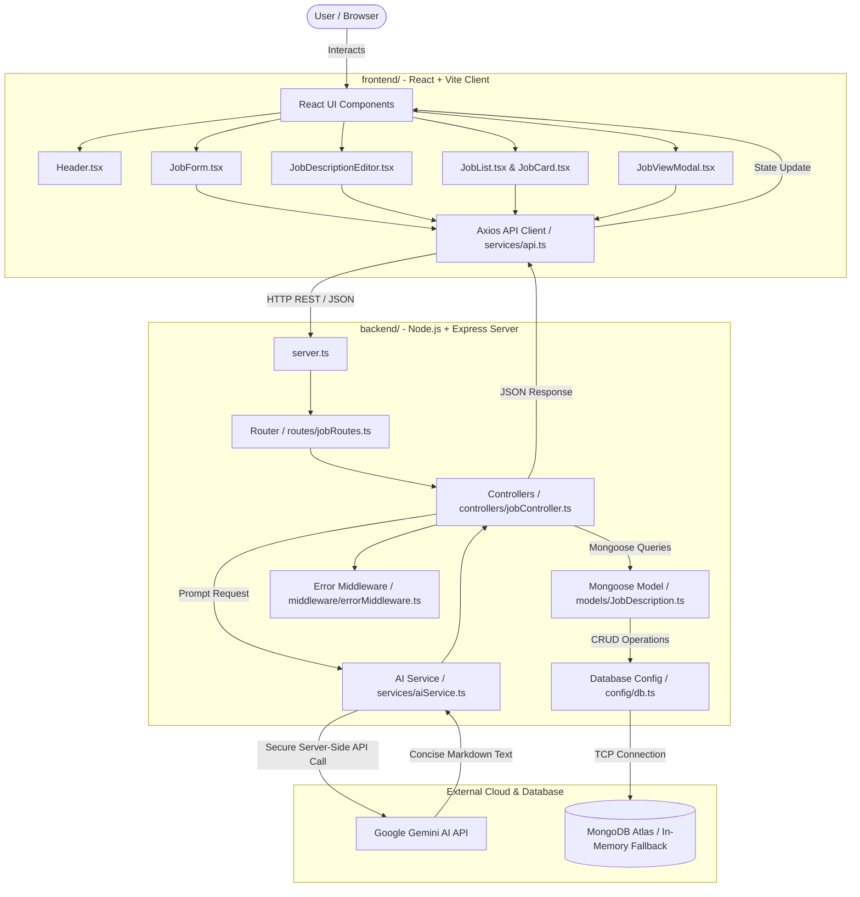

# JobCraft Architecture Documentation

## 1. System Architecture Diagram

---

## 2. Decoupled MERN Responsibilities

### Frontend Layer (`frontend/`)
- **Single Responsibility**: Render UI, capture user requirements, manage interactive editing state, and display toasts.
- **REST Client (`frontend/src/services/api.ts`)**: Encapsulates all backend HTTP communication via Axios with baseURL configurable via `VITE_API_URL`.
- **Zero Secrets**: Contains no MongoDB drivers, no Mongoose schemas, and no Gemini API credentials.

### Backend Layer (`backend/`)
- **Single Responsibility**: Route handling, payload validation, AI generation orchestration, and database persistence.
- **Controller Layer (`backend/controllers/jobController.ts`)**: Handles CRUD operations and AI invocation.
- **AI Service (`backend/services/aiService.ts`)**: Houses the Google GenAI SDK integration with multi-model fallback (`gemini-3.1-flash-lite`, `gemini-3.7-flash`, `gemini-flash-latest`) and strict prompt rules.
- **Database Layer (`backend/config/db.ts` & `backend/models/JobDescription.ts`)**: Mongoose models with validation and automatic in-memory fallback for zero-configuration testing.

---

## 3. Data Flow Steps

1. **Job Input & Validation**:
   - User enters role title, company, experience, skills, location, and employment type.
   - Frontend validates fields and dispatches a `POST /api/jobs/generate` request.

2. **AI Generation**:
   - Backend validates the incoming payload.
   - `aiService.ts` prompts Gemini with strict word limits (150–250 words) and grounding rules.
   - Returns a structured markdown job description.

3. **Live Edit & Action**:
   - User reviews draft in the markdown editor/preview.
   - Can edit any line, copy to clipboard, or save to MongoDB.

4. **Persistence & Gallery**:
   - Clicking "Save" calls `POST /api/jobs`.
   - The saved job is stored in MongoDB and immediately rendered in the "My Job Descriptions" list.
